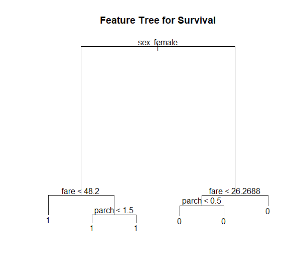
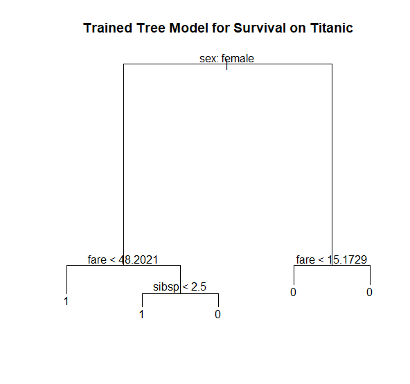
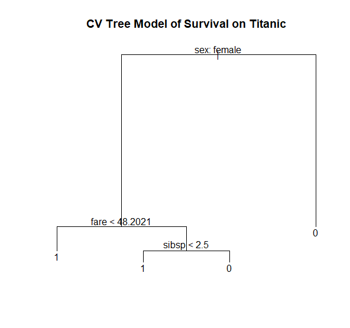

# Titanic_Tree_Model
The aim of this project was to create a Tree model to determine which features were the main factors for survival on the Titanic.

First the data is imported using the data.table and tidyverse libraries. The data is taken from online at the following website: https://goo.gl/At238b

Using the tree library a basic tree is creating using all the data:

We can see a few features seem redundant, as they will result in a 0 (did not survive) after taking the first branch of the tree, and no subsequent branch changes that outcome.

The data is then split into training and testing groups and a tree is constructed using just the trianed data.

Cross-validation and pruning is applied to the trained model to get our new tree:

Evaluation of the tree model is determined using the confusion matrix, with an accuracy just above 78%.

For full code please see the R file: Tree_Survival_TItanic.R
